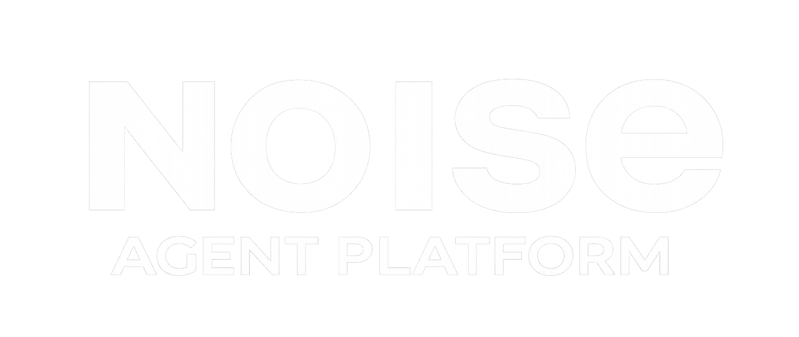

<p align="center">
  
</p>

<p align="center">
  
  
  
  
  
  
</p>

<p align="center">Internal platform for building, running, and iterating on AI agents. Provides a Next.js agent library UI, a multi-agent backend, and an MCP layer.</p>

## Prerequisites

- Docker Desktop
- Git installed and configured
- IAM permissions to nd-agentspace

## Getting Started

1. Enable automatic tasks:
   - Command Palette → **Tasks: Manage Automatic Tasks in Folder** → **Allow Automatic Tasks in Folder**

2. Open the repo in VS Code and select **Reopen in Container**.

3. The **Start Services** task runs automatically in a terminal panel and handles everything:

- Runs `scripts/start_services.sh`
- Creates `.env` from `.env.example` if it doesn't exist — review `GOOGLE_CLOUD_PROJECT` before first use
- Prompts for GCP authentication if credentials are missing — click the URL, sign in, paste the code back
- Starts core app services (`postgres`, `mcp-toolbox`, `agents`, `frontend`)
- Bootstraps optional MCP profile env files from `.env.example` to `.env` under `services/backend/mcp/images/` (except `google-ads`, which is synced from Secret Manager)

   On subsequent opens, if credentials already exist the auth step is skipped and services start immediately.

1. Pre-commit hooks are installed automatically on first container create.

2. All services should be up and running, attachable in their own VSCode windows

> To restart services: **Terminal → Run Task → Start Services**
> To inspect compose logs: **Terminal → Run Task → Compose Logs**
> GCP credentials are stored in the `gcloud_config` Docker volume and shared with all services that need ADC.

**Git identity** — the devcontainer mounts your host `~/.gitconfig` so your name and email carry over automatically. If you see *"Author identity unknown"*, configure git on your host first:

```bash
git config --global user.email "you@example.com"
git config --global user.name "Your Name"
```

| URL | Description | Open On Startup |
|---|---|---|
| <http://localhost:3000> | Frontend chat UI | true |
| <http://localhost:8080/healthz> | Gateway (public API, proxies the agent) | true |
| <http://localhost:8000/dev-ui> | ADK dev UI (private — gateway proxies anything the frontend needs) | true |
| <http://localhost:5000/ui> | MCP Toolbox UI | false |
| <http://localhost:5001/mcp> | Google Ads MCP (optional profile) | false |
| <http://localhost:5002/mcp> | Math MCP (optional profile) | false |
| <http://localhost:5432> | Postgres DB | false |

## Project Structure

```
services/
├── frontend/                       # Next.js 15 platform UI (chat + dashboards + GenUI)
├── backend/
│   ├── gateway/                    # FastAPI gateway — auth, Alembic, proxy to agent
│   │   ├── alembic/                #   platform-owned Postgres migrations
│   │   └── api/                    #   auth, health, agent proxy
│   ├── agents/                     # ADK agents + FastAPI host
│   │   ├── adk_agents/             #   one package per agent
│   │   ├── api/                    #   platform-owned routes (sessions, events, sources, dashboards)
│   │   └── main.py                 #   get_fast_api_app() entrypoint
│   ├── mcp/                        # MCP servers (image-based + code-based)
│   │   ├── images/                 #   image-based MCP configs (toolbox tools.yaml lives here)
│   │   ├── math/                   #   code-based MCP server
│   │   └── stats/                  #   code-based MCP server (correlate / regress / QA)
│   ├── tagging/
│   │   └── sgtm/                   # server-side Google Tag Manager (gtag → sGTM → GA4)
│   └── database/                   # Postgres init scripts
terraform/                          # GCP infrastructure
```

### Service topology

```text
browser ─► gateway (8080) ─┬─► agents (8000)           ─► postgres
                           │     ├─► mcp-toolbox (5000) ─► BigQuery
                           │     └─► mcp-stats (5003)   ─► uploads
                           ├─► mcp-toolbox (dashboard query)
                           └─► mcp-stats   (analyze: correlate / qa / describe)

# Boot: gateway runs `alembic upgrade head` in its entrypoint, then starts
# uvicorn. Its /healthz turns green only once both have completed; the
# agent waits on that healthcheck before reading the platform tables.
```

The frontend talks **only** to the gateway. The gateway is the public seam
for every backend service:
- ADK runtime (sessions, `/run_sse`, …) → proxied to `agents` via the catch-all.
- Dashboard queries → `/api/dashboards/query` calls the MCP Toolbox directly.
- Analyze stats (correlate / qa / describe) → `/api/stats/<endpoint>` proxies
  to `mcp-stats`.

This shape matches the GCP deployment: in production the agent, toolbox, and
stats services run on internal-only Cloud Run ingress, and the gateway is the
only thing the browser can reach. The platform's Postgres schema is owned by
**Alembic** in the gateway service.

## Adding an Agent

The ADK server auto-discovers agents in `services/backend/agents/adk_agents/<name>/agent.py` — define a top-level `root_agent`. See [CONTRIBUTING.md](CONTRIBUTING.md#adding-an-agent) for the full steps including the `agentConfig.tsx` display flags.

## Using MCP Toolbox

Tools are defined in `services/backend/mcp/images/toolbox/tools.yaml` using the v1.0+ flat document format. The MCP Toolbox service is available at `http://mcp-toolbox:5000` inside the Docker network.

> **Note:** MCP Toolbox server v1.1.0 speaks protocol `2025-03-26`. Pass `protocol=Protocol.MCP_v20250326` to `ToolboxSyncClient` to avoid a version mismatch error until the server supports a newer protocol spec.

```python
import os
from toolbox_core import ToolboxSyncClient
from toolbox_core.protocol import Protocol

TOOLBOX_ENDPOINT = os.getenv("TOOLBOX_ENDPOINT", "http://mcp-toolbox:5000")
toolbox = ToolboxSyncClient(TOOLBOX_ENDPOINT, protocol=Protocol.MCP_v20250326)
tools = toolbox.load_toolset("my_toolset")
```

## Optional MCP Profiles

Core services start automatically in the devcontainer. Optional MCP servers are profile-gated and must be started explicitly.

```bash
./scripts/start_optional_mcp.sh google-ads
./scripts/start_optional_mcp.sh math
```

Notes:
- `mcp-google-ads` reads credentials from `services/backend/mcp/images/google-ads/.env`, synced from Secret Manager
- HTTP mode (`/mcp`) for Google Ads MCP requires OAuth proxy env vars (`GOOGLE_ADS_MCP_OAUTH_CLIENT_ID` and `GOOGLE_ADS_MCP_OAUTH_CLIENT_SECRET`)
- Secret payload must include these keys: `GOOGLE_PROJECT_ID`, `GOOGLE_ADS_DEVELOPER_TOKEN`, `GOOGLE_ADS_MCP_OAUTH_CLIENT_ID`, `GOOGLE_ADS_MCP_OAUTH_CLIENT_SECRET`, `GOOGLE_ADS_MCP_BASE_URL`
- Configure secret sync in root `.env`:
  - `GOOGLE_ADS_MCP_ENV_SECRET_NAME` (required)
  - `GOOGLE_ADS_MCP_ENV_SECRET_PROJECT` (optional; defaults to `GOOGLE_CLOUD_PROJECT`)
  - `GOOGLE_ADS_MCP_ENV_SECRET_VERSION` (optional; defaults to `latest`)
  - `GOOGLE_IMPERSONATE_SERVICE_ACCOUNT` (optional; uses IAM impersonation, no local key file)
- If the current user cannot access the configured secret, the generated `.env` is removed and `mcp-google-ads` cannot be started.

## Analytics / server-side tagging

Frontend GA (`gtag.js`) routes measurement data through a server-side Google
Tag Manager container instead of straight to Google. The browser posts to the
`sgtm` service (`server_container_url`), which forwards to GA4 per the tags you
publish in the GTM UI.

- **Code owns:** the `sgtm` *service* (`services/backend/tagging/sgtm`, an
  image-based service like the toolbox), the frontend `gtag` wiring, and the
  env/secrets. **GTM owns** the tag/trigger/variable logic — authored in the
  GTM UI and published; the container fetches its published config at runtime.
- **Profile-gated** (`tagging`): needs `SGTM_CONTAINER_CONFIG` from a GTM Server
  container, so it stays off until configured — `docker compose --profile tagging up`.
- **Prod:** gated on a committed `enable_sgtm` toggle; the CONTAINER_CONFIG value
  lives only in Secret Manager (added out-of-band — never in tfvars or state).

Setup (local + the full prod runbook) is in [DEPLOY.md §6](DEPLOY.md); how the
service works internally is in
[services/backend/tagging/sgtm/README.md](services/backend/tagging/sgtm/README.md).

## Schema Migrations

Platform-owned Postgres tables (`session_metadata`, `event_metadata`, `sources`)
are managed by **Alembic** in the gateway. ADK manages its own tables and
ships its own migrations on version updates — we never touch those.

On `docker compose up`, the gateway's entrypoint runs `alembic upgrade head`
against Postgres and only then starts uvicorn — its `/healthz` flips green
once both steps complete. Any service that touches the platform tables
(currently just `agents`) waits on `gateway: service_healthy`, so the schema
is always at head before anyone reads it. Migrations are idempotent, so a
restart is safe. CI applies them to a fresh Postgres on every PR.

Add a migration:

```bash
docker compose exec gateway uv run alembic revision -m "short description"
# edit the generated file in services/backend/gateway/alembic/versions/
docker compose restart gateway   # gateway re-runs upgrade head on boot
```

See [CONTRIBUTING.md](CONTRIBUTING.md#schema-migrations) for the full workflow.

## Architecture docs

Going deeper than this README — agent contracts, the GenUI envelope, the
dashboard tile registry — see [`docs/`](docs/):

- [`docs/agents.md`](docs/agents.md) — agent catalog + routing + action contract.
- [`docs/genui.md`](docs/genui.md) — `{ text, ui }` envelope, block catalog, parser failure modes.
- [`docs/dashboards.md`](docs/dashboards.md) — tile registry, presentation overrides, footguns.

## Contributing

See [CONTRIBUTING.md](CONTRIBUTING.md) for branch naming, commit conventions, CI requirements, and guidelines for adding agents and tools.

## Deployment

CI runs on every push and PR (`ruff`, `ESLint`, `tsc`, `vitest`, `pytest`, `alembic upgrade head`, `terraform validate`, `docker compose config`). All checks must pass before merge.

### EX: MCP Toolbox to Cloud Run

```bash
export IMAGE=us-central1-docker.pkg.dev/database-toolbox/toolbox/toolbox:1.1.0
gcloud run deploy mcp-toolbox \
  --image $IMAGE \
  --service-account toolbox-identity \
  --region us-central1 \
  --set-secrets "/app/tools.yaml=tools:latest" \
  --args="--config=/app/tools.yaml","--address=0.0.0.0","--port=8080"
```
