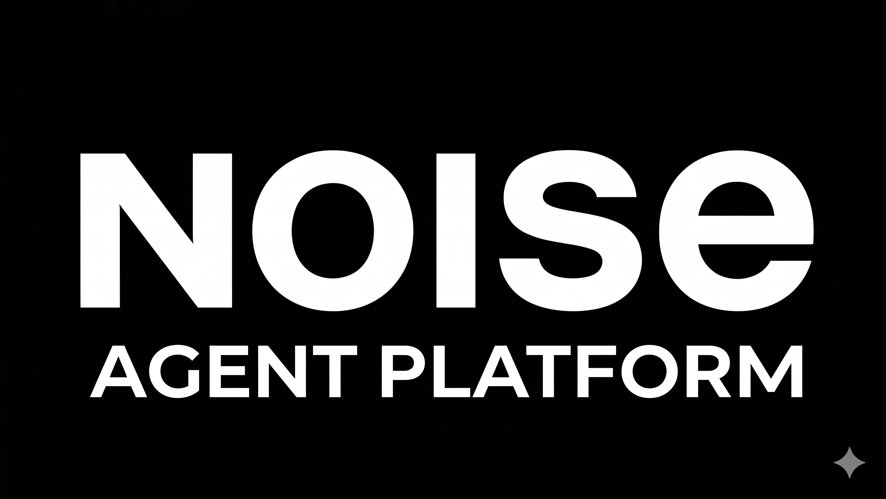

<p align="center">
  
</p>

<p align="center">
  
  
  
  
  
  
</p>

<p align="center">Internal platform for building, running, and iterating on AI agents. Provides a Next.js agent library UI, a multi-agent backend, and an MCP layer.</p>

## Prerequisites

- Docker Desktop
- Copy `.env.example` to `.env` and fill in GCP project details:
  ```bash
  cp .env.example .env
  ```

## Getting Started

### Devcontainer

Open the repo in VS Code and select **Reopen in Container**.

On first open, a terminal will open and run startup (/scripts/start_services.sh) automatically:
1. If GCP credentials are missing, a browser window opens for `gcloud auth application-default login`
2. All services start (postgres, mcp, agent, frontend)
3. All services are on hot reload, but you can manage the compose services in the root container with standard `docker-compose` commands if necessary

On every subsequent attach, services start automatically without credential prompts.

Credentials are written to `/root/.config/gcloud` in the devcontainer and bind-mounted read-only into the relevant service containers.

**Service logs** — run the **Compose Logs** task (**Terminal → Run Task → Compose Logs**) to stream live logs from all services.

**Git identity** — the devcontainer mounts your host `~/.gitconfig` so your name and email carry over automatically. If you see *"Author identity unknown"*, configure git on your host first:

```bash
git config --global user.email "you@example.com"
git config --global user.name "Your Name"
```


| URL | Description | Open On Startup |
|---|---|---|
| http://localhost:3000 | Frontend chat UI | true |
| http://localhost:8000/dev-ui | ADK API / dev UI | true |
| http://localhost:5000/ui | MCP Toolbox UI | false |
| http://localhost:5432 | Postgres DB | false |


## Project Structure

```
services/
├── frontend/               # Platform UI
├── backend/
│   ├── agents/             # ADK agents + FastAPI host
│   │   ├── adk_agents/     # Individual agent packages
│   │   └── main.py         # get_fast_api_app() entrypoint
│   ├── mcp/                # MCP Toolbox server + tools.yaml
│   └── database/           # Postgres
terraform/                  # GCP infrastructure
```

## Adding an Agent

The ADK server auto-discovers agents — no registration needed. See [CONTRIBUTING.md](CONTRIBUTING.md) for full steps and `agentConfig.tsx` display flags.

**Minimal `agent.py`:**
```python
from google.adk.agents import Agent

root_agent = Agent(
    name="my_agent",
    model="gemini-2.5-flash",
    instruction="You are a helpful assistant.",
)
```

## Using MCP Toolbox

Tools are defined in `services/backend/mcp/mcp-toolbox/tools.yaml` using the v1.0+ flat document format. The MCP service is available at `http://mcp:5000` inside the Docker network.

> **Note:** MCP Toolbox server v1.1.0 speaks protocol `2025-03-26`. Pass `protocol=Protocol.MCP_v20250326` to `ToolboxSyncClient` to avoid a version mismatch error until the server supports a newer protocol spec.

```python
import os
from toolbox_core import ToolboxSyncClient
from toolbox_core.protocol import Protocol

TOOLBOX_ENDPOINT = os.getenv("TOOLBOX_ENDPOINT", "http://mcp:5000")
toolbox = ToolboxSyncClient(TOOLBOX_ENDPOINT, protocol=Protocol.MCP_v20250326)
tools = toolbox.load_toolset("my_toolset")
```

## Environment Variables

Key variables with their defaults (set in `.env` or shell to override):

| Variable | Default | Description |
|---|---|---|
| `GOOGLE_CLOUD_PROJECT` | `nd-agentspace-sbx` | GCP project |
| `GOOGLE_CLOUD_LOCATION` | `northamerica-northeast1` | GCP region |
| `GOOGLE_MODEL_NAME` | `gemini-2.5-flash` | Default model |
| `TOOLBOX_ENDPOINT` | `http://mcp:5000` | MCP Toolbox URL |
| `AGENTS_BASE_URL` | `http://localhost:8000` | Agent API (browser-side) |

## Contributing

See [CONTRIBUTING.md](CONTRIBUTING.md) for branch naming, commit conventions, CI requirements, and guidelines for adding agents and tools.

## Deployment

CI runs on every push and PR (`ruff`, `ESLint`, `tsc`, `terraform validate`, `docker compose config`). All checks must pass before merge.

### MCP Toolbox to Cloud Run

```bash
export IMAGE=us-central1-docker.pkg.dev/database-toolbox/toolbox/toolbox:1.1.0
gcloud run deploy mcp-toolbox \
  --image $IMAGE \
  --service-account toolbox-identity \
  --region us-central1 \
  --set-secrets "/app/tools.yaml=tools:latest" \
  --args="--config=/app/tools.yaml","--address=0.0.0.0","--port=8080"
```
